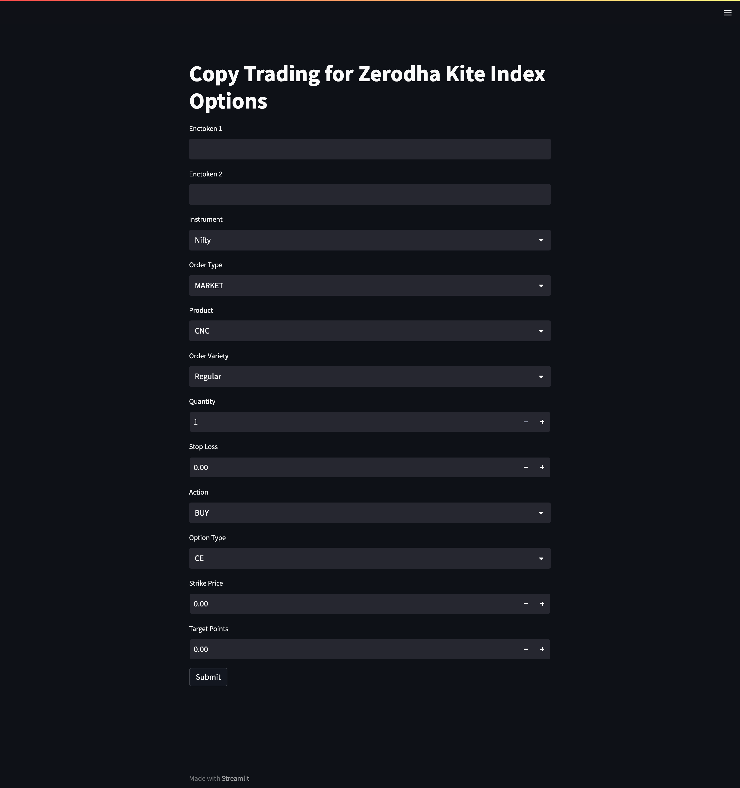

# Copy Trading for Zerodha Kite Index Options

This is a simple application using Streamlit and the Kite Connect API to place orders for index options on the Zerodha Kite platform. The app allows users to enter their encrypted tokens (enctokens), instrument type, order type, product, order variety, quantity, stop loss, action, option type, strike price, and target points. Users can then submit their orders and receive a confirmation with the order IDs.



## Getting Started

### Prerequisites

- Python 3.7 or higher
- Streamlit
- Kite Connect API

## To install the required dependencies, run:

```bash ```
pip install streamlit kiteconnect

## Installing

If you want to run the program locally Install dependencies via 

``` pip install -r requirements.txt ```

## Executing program

Then once you have activated your virtual environment in the terminal
simply write

``` streamlit run app_streamlit.py ```

A new browser window should automatically open and you should be able to see the streamlit interface.


## Note
Please make sure to replace the placeholder functions (place_order, get_expiry_date, get_weekly_symbol, get_price) with the actual implementations based on the Kite Connect API documentation.

Refer to the Kite Connect API documentation to understand the required parameters and their usage: https://kite.trade/docs/connect/v3/

## Authors

Karthik Gandu

[Github](https://github.com/KarthikGandu)  
[LinkedIn](https://www.linkedin.com/in/karthik-g-7a748518a/)

